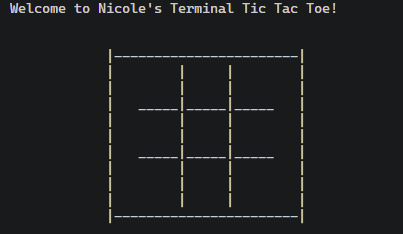

# Tic Tac Toe (C++)



A terminal-based Tic Tac Toe game built in C++

## Features
- Two-player gameplay in the terminal
- Turn-based game loop
- Input validation for taken spaces
- Win detection for all 8 winning combinations
- Draw detection
- Modular code structure using functions and header files

## Technologies
- C++
- VSCode
- Git & GitHub

## How to Run

Compile the project:

```powershell
g++ ttt.cpp ttt_functions.cpp -o ttt
```

Run the executable:

```powershell
.\ttt.exe
```
